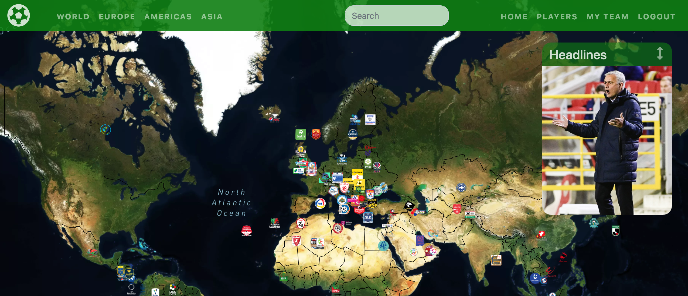
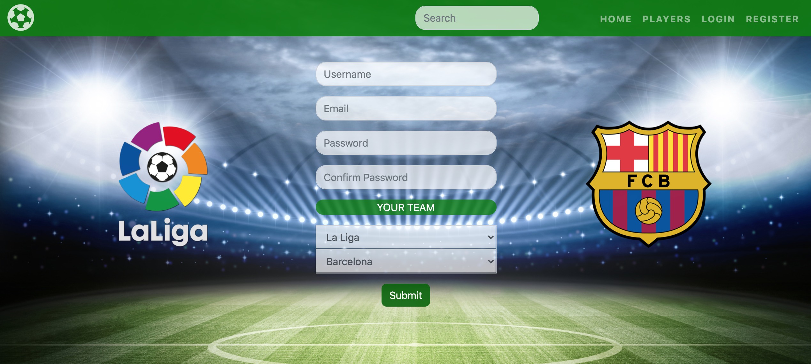
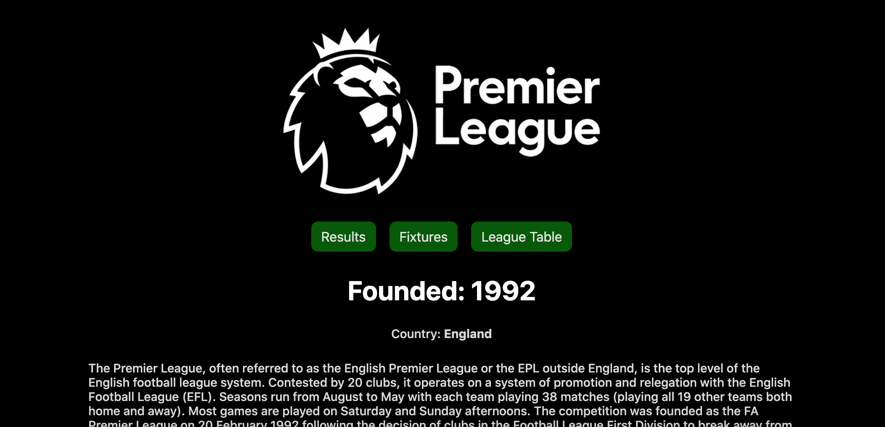
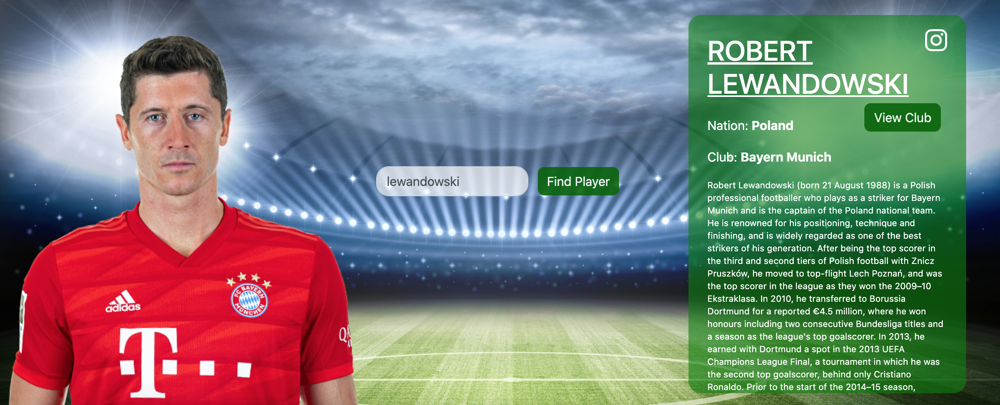
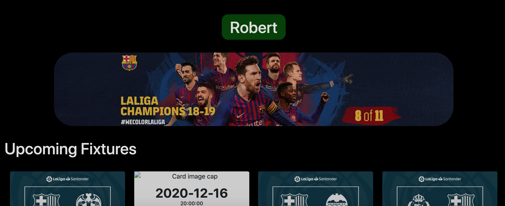

# Football Map

## Overview

My fourth and final project of the Software Engeneering Immersive bootcamp in General Assembly. As a pair we built a full stack website, using React, Flask and PostgreSQL. Using GitHub and Git to collaborate, we were building on our skills to combine our JavaScript and Python knowledge.

[CHECK IT OUT HERE](https://football-map.herokuapp.com/)

## Brief

- Create a full stack website.
- The webiste had to give functionality to the user, with a login/register page and to implement an API to reveal information.
- Our site was to be deployed using Heroku and the PostgreSQL extension.
- Give the project meaning, as if the user would actually find the experience useful.
- Use a framework for responsiveness.
- Stick with KISS (Keep It Simple Stupid) and DRY (Don't Repeat Yourself) principles.
- Use best practices for writing code, such as semantic markup.
- Serialize/Deserialize our JSON requests so that our data can be saved as an SQL database.

**Technologies used:**

- HTML5
- CSS
- JavaScript ES6
- Git
- GitHub
- React
- Node
- Flask
- SQLAlchemy
- Marshmallow
- Bootstrap framework
- Axios
- Bcrypt
- Json Web Token
- React native maps
- React Hooks
- Font Awesome
- React Reveal
- External footbal API, geolocation API and news API.

## Approach

We decided to construct a football website where the football leagues were displayed using React native maps. We decided to gather information such as fixtures, results, live table standings, news, and players.

I was responsible mainly for the React front end, using our Flask endpoints to render our databse. Also, I helped out with the controller and schema logic.

For our React frontend, we implemented bootstrap as our css framework, giving us good efficiency when creating the interface.

## API

After searching many external football API's, we settled on thesportsdb.com as it gave most of our data as a free plan. We knew we had to add geolocation so we also found opencagedata.com to seed the coordinates of the country a league belongs to. For the news section we used newsapi.org to get specific football related articles.


## Home Page

Using React native maps, the seeded leagues were plotted on a world map, with the league badge working as a marker.



- A snippet of our map. We used a custom mapStyle and transitionInterpolator to give a clean theme to the page and to give a flying in effect when different regions are toggled.

```js
{leagues && <MapGL

      mapboxApiAccessToken={'pk.eyJ1Ijoic2Vhbi1mZW5lbG9uIiwiYSI6ImNraGMxbHBvOTAycWUycm1wczNpemZ0MGsifQ.phMK4dt1j_7wvlbYTbLWxg'}
      mapStyle='mapbox://styles/kasjanhinc/cki93e734c41r19qu8nbtm8fa'
      transitionInterpolator={new FlyToInterpolator()}
      transitionDuration={1000}
      {...viewPort}
      onViewportChange={(viewPort) => setViewPort(viewPort)}
    >
```
- A useEffect working with axios to fetch our news from our endpoint and render a floating headlines div for the user to check out the latest footballing related news.

```js
  useEffect(() => {
    axios.get('/api/news')
      .then(resp => {
        const articles = resp.data
        console.log(resp)
        setNews(articles)
      })
  }, [])
```

## Navbar

The navbar includes React links to other pages, as well as a search bar which allows the user to find a league or team in our database. The navbar is rendered on each page in our website.


- A fetch for our teams, then the data is placed into the searchData object using .concat(). 

``` js
  useEffect(() => {
    axios.get('/api/teams')
      .then((resp) => {
        const teams = resp.data
        const finalSearchData = [...searchData]

        for (let i = 0; i < teams.length; i++) {
          finalSearchData.push(teams[i])
        }
        
        setSearchData(searchData => searchData.concat(finalSearchData))
      })
  }, [])
```

- A search results div is shown when the users input matches with the name of a league or team in our database. The search input updates a searchTerm state on every key change, giving a live search feed.

``` js
        <div className="search-results">

          {searchData.filter((val) => {
            if (searchTerm === '') {
              return ''
            } else if (val.name.toLowerCase().includes(searchTerm.toLowerCase())) {
              return val
            }

          }).map((val, key) => {

            if (val.id.toString().length < 5) {
              return <Link to={`/league/${val.id}`} key={key} onClick={closeSearch}>{val.name}</Link>

            } else if (val.id.toString().length > 5) {
              return <Link to={`/team/${val.id}`} key={key} onClick={closeSearch}>{val.name}</Link>
            }

          })}
          
        </div>
```

- The search input field. React Reveal is used for the entry animation and Bootstrap for some core styling.

```js
        <Fade>
          <form className="form-inline my-2 my-lg-0 search-bar">
            <input className="form-control mr-sm-2"
              type="search"
              placeholder="Search"
              aria-label="Search"
              value={searchTerm}
              onChange={(event) => {
                setSearchTerm(event.target.value)
              }}
            />
          </form>
        </Fade>
```


## Registration

Using React Reveal, the user is able to view their current favourite team choice in real time, as the select field triggers a new axios fetch of the league and teams badge.



- Leagues object from which the select input gets its data.

```js
const leagues = [
    { id: 4328, name: 'Premier League' },
    { id: 4331, name: 'Bundesliga' },
    { id: 4335, name: 'La Liga' },
    { id: 4332, name: 'Seria A' },
    { id: 4334, name: 'Ligue 1' },
    { id: 4337, name: 'Eredivisie' },
    { id: 4346, name: 'MLS' },
    { id: 4344, name: 'Primeira Liga' },
    { id: 4359, name: 'Chinese Super League' },
    { id: 4330, name: 'Scottish Premier League' },
    { id: 4336, name: 'Superleague Greece' },
    { id: 4338, name: 'Belgian First Division A' },
    { id: 4339, name: 'Turkish Super Lig' },
    { id: 4351, name: 'Brazilian Serie A' },
    { id: 4355, name: 'Russian Football Premier League' },
    { id: 4347, name: 'Swedish Allsvenskan' },
    { id: 4350, name: 'Mexican Primera League' },
    { id: 4354, name: 'Ukrainian Premier League' },
    { id: 4358, name: 'Norwegian Eliteserien' }
  ]
```

- Axios fetching all the teams of the current selected league id.

```js
useEffect(() => {
    axios.get(`https://www.thesportsdb.com/api/v1/json/1/lookup_all_teams.php?id=${formData.league}`)
      .then(resp => {
        const teams = resp.data.teams
        setTeams(teams)
      })
  }, [formData])
```

- React reveal sliding animation spying on the formData, as it updates a new animation is triggered.

```js
<Slide right appear spy={formData.team} duration={500}>
          </img>
        </Slide>

        <Slide left appear spy={formData.league} duration={500}>
          </img>
        </Slide>
```

## League / Team Pages

- Here we have a league or teams basic information. For a league page, the teams that belong to that league are also mapped out in the form of Bootstrap cards. The Fade animation from React Reveal spies on the league/team id, so that when the data is transferred into state from axios the page will animate only then, resuting in a smooth transition.



```js 
<Fade appear spy={id}>
        <div className="card-league text-center">
          
          <div className="resfixbtn">
            <Link to={`/league/${id}/results`} className="btn btn-dark btn-resfix">Results</Link>
            <Link to={`/league/${id}/fixtures`} className="btn btn-dark btn-resfix">Fixtures</Link>
            <Link to={`/league/${id}/table`} className="btn btn-dark btn-resfix">League Table</Link>
          </div>
          <div className="card-body">
            <h1 className="year"><strong>Founded: {league.year}</strong></h1>
            <h5 className="card-desc text-center">Country: <strong>{league.country}</strong></h5>
            <h5 className="card-desc">{league.description}</h5>
            <a href={`https://${league.website}`} target="_blank" className="card-website">LEAGUE WEBSITE</a>

          </div>
        </div>
      </Fade>
```

- A live league table with current standings are also available. Created with html tables based on the fetched data.

```js
 <Fade>
      {dataReady && <table>
        <tr className="table-top">
          <th className="table-top-columns">Club</th>
          <th className="table-top-columns">MP</th>
          <th className="table-top-columns">W</th>
          <th className="table-top-columns">D</th>
          <th className="table-top-columns">L</th>
          <th className="table-top-columns">GF</th>
          <th className="table-top-columns">GA</th>
          <th className="table-top-columns">GD</th>
          <th className="table-top-columns"><strong>PTS</strong></th>
        </tr>

        {table.map((team, index) => {
          return <tr className="last-table-item" key={index}>
            <th><strong><Link to={`/team/${team.teamid}`}>{team.name}</Link></strong></th>
            <th>{team.played}</th>
            <th>{team.win}</th>
            <th>{team.draw}</th>
            <th>{team.loss}</th>
            <th>{team.goalsfor}</th>
            <th>{team.goalsagainst}</th>
            <th>{team.goalsdifference}</th>
            <th><strong>{team.total}</strong></th>
          </tr>
        })}
      </table>}
    </Fade>
```

- The backend schema model for a league, it exntends from the BaseModel, which has also an id and createdAt and updatedAt fields. A relationship is made with a team which belongs to a given league.

```py
from app import db
from models.base import BaseModel
from models.team import Team

class League(db.Model, BaseModel):

  __tablename__ = 'leagues'

  name = db.Column(db.String(100), nullable=False, unique=True)
  year = db.Column(db.Integer(), nullable=True)
  country = db.Column(db.String(100), nullable=False)
  description = db.Column(db.String(10000), nullable=True)
  website = db.Column(db.String(200), nullable=True)
  image = db.Column(db.String(200), nullable=True)
  badge = db.Column(db.String(200), nullable=True)
  lon = db.Column(db.Integer(), nullable=False)
  lat = db.Column(db.Integer(), nullable=False)
  teams = db.relationship('Team', backref='league')
```

## Players Page

- Similar to the navbar search, however the searching is done from the external football API based on an endpoint which allows you to get a player by his name. We originally planned on seeding the players to our PostgreSQL, however no football API offers this currently on a free plan.



```js
 const [currentPlayer, setCurrentPlayer] = useState({})
 const [searchTerm, setSearchTerm] = useState('messi')
 const [dataReady, setDataReady] = useState(1)
 const [errors, updateErrors] = useState('')
```

- Here axios is using GET to talk to our Flask controller. Based on the response, the player object is either placed in the currentPlayer state or the response error messages are updated so that the user knows he/she has to refine the search.

```js
  useEffect(() => {
    axios.get(`/api/player/${searchTerm}`)
      .then((resp) => {
   
        const player = resp.data

        if (resp.data.message) {

          const message = resp.data.message
          console.log(message)
          updateErrors(message)
          
        } else {
          setCurrentPlayer(player)
        }

      })
  }, [dataReady])
```

- The controller logic which communicates with the external football API. If the API returns a valid JSON object, the player is sent to our frontend, otherwise an error message. 

```py
@router.route('/player/<string:name>', methods=['GET'])
def get_single_player(name):

  player = requests.get(f'https://www.thesportsdb.com/api/v1/json/1/searchplayers.php?p={name}')

  if player.status_code != 200 :
    return {'message': 'Refine your search'}
  player = player.json().get('player')
  if not player:
    return {'message': 'Refine your search'}
  player = player[0]
  if not player:
    return {'message': 'Refine your search'}
  player_json = dict(
    player_name=player['strPlayer'],
    team_name=player['strTeam'],
    team_id=player['idTeam'],
    description=player['strDescriptionEN'],
    date_of_birth=player['dateBorn'],
    nationality=player['strNationality'],
    instagram=player['strInstagram'],
    image=player['strCutout']
  )

  return player_json, 200
```

- If an error exists, it is displayed just under the input.

```py
{errors && <p className="error" >{errors}</p>}
```

## JSON Web Token

A token stored in localstorage is used to determine the users id. The id of the user helps with displaying the users favourite team information in the My Team page.

- Here the getUserId function is exported from our lib folder to be used in authentication where needed. The token is parsed to get a unique string which represents the user. Then the id of the user is given back as parsedToken.sub.

```js
export function getUserId() {

  const token = localStorage.getItem('token')

  if (!token) return false

  const parsedToken = JSON.parse(atob(token.split('.')[1]))
  return parsedToken.sub
}
```

- The My Team link is checking for a token in the localstorage and using the parsed.sub id to create a link to the current users page.

```js
{
          token && <li className="nav-item">
            <Link to={`/users/${finalId}`} className="nav-link">My Team</Link>
          </li>
        }
```


## My Team

The users favourite team results and fixtures are shown. As well a a team banner.




- Here is axios fetching our current user from our Flask endpoint. The account data state is updated and the getTeam function is triggered so that another fetch can retrive the users team based on the team value in his/hers account data.

```js
  const [accountData, updateAccountData] = useState({})

useEffect(() => {
    axios.get(`/api/users/${props.match.params.id}`)
      .then((resp) => {
      
        updateAccountData(resp.data)
        
        const team = resp.data.team
        getTeam(team)

      })
  }, [])
```

- The getTeam function which also gets the teams results and fixtures.

```js
const getTeam = (team) => {
    axios.get(`/api/team/${team}`)
      .then((resp) => {
        setTeamInfo(resp.data)
        console.log(resp.data)
      })

    axios.get(`https://www.thesportsdb.com/api/v1/json/1/eventsnext.php?id=${team}`)
      .then((resp) => {
        const events = resp.data.events
        console.log(events)
        setTeamEvents(events)

      })

    axios.get(`https://www.thesportsdb.com/api/v1/json/1/eventslast.php?id=${team}`)
      .then((resp) => {

        const results = resp.data.results
        console.log(results)
        setTeamResults(results)

      })
  }
```

- Mapping out the users name and the favourite team banner.

```js
    <Fade>
      <h1 className="username">{accountData.username}</h1>

      <div className="myteaminfo">
        
        <h1 className="myteamheader">Upcoming Fixtures</h1>
      </div>
    </Fade>
```

- An example of how the favourite team fixtures are mapped out, the render only happens when the teamEvents have been added to the state.

```js
{teamEvents.map((result, index) => {

        return <div key={index} className="card text-center">
          
          <div className="card-body">
            <h1 className="date"><strong>{result.dateEvent}</strong></h1>
            <h5 className="card-time">{result.strTime}</h5>
            <h4 className="card-text-venue"><strong>{result.strVenue}</strong></h4>
            <h5 className="card-round">Round {result.intRound}</h5>
            <h5 className="card-round">{result.strStatus}</h5>

          </div>
        </div>

      })}
```

## Seeded Data

The seed file we used to populate our API, with all the leagues and teams fetched from our external football API. A for loop is used to create a Python dictionary for each league and team, with an if statement which filters out the non football leagues. For each dictionary, geolocation in the form of lattitude and longtitude are added for the purpose of the home map.

```js 
   league_list = requests.get('https://www.thesportsdb.com/api/v1/json/1/all_leagues.php').json()
    league_object_list = []
    countries = {}
    existing_team_ids = set()
    print("starting ...")
    for league in tqdm(league_list['leagues']):
        if league['strSport'] == 'Soccer':
            league_details = requests.get(
                f'https://www.thesportsdb.com/api/v1/json/1/lookupleague.php?id={league["idLeague"]}').json()
            league_details = league_details['leagues'][0]
            country = league_details['strCountry']
            if country in countries:
                country_latlng = countries[country]
            else:
                country_latlng = requests.get(
                    f'https://api.opencagedata.com/geocode/v1/json?q={league_details["strCountry"]}&key=ab82c77042d74ae6aae0bb67ff494887').json()
                country_latlng = country_latlng['results'][0]['bounds']
                countries[country] = country_latlng

            league_object = League(
                id=league_details['idLeague'],
                name=league_details['strLeague'],
                year=league_details['intFormedYear'],
                country=league_details['strCountry'],
                description=league_details['strDescriptionEN'],
                website=league_details['strWebsite'],
                image=league_details['strLogo'],
                badge=league_details['strBadge'],
                lon=(float(country_latlng['northeast']['lng']) +
                     float(country_latlng['southwest']['lng']))/2,
                lat=(float(country_latlng['northeast']['lat']) +
                     float(country_latlng['southwest']['lat']))/2
            )
            league_object_list.append(league_object)
            team_list = requests.get(
                f'https://www.thesportsdb.com/api/v1/json/1/lookup_all_teams.php?id={league["idLeague"]}').json()
            if not team_list['teams']:
                continue
            for team in team_list['teams']:
                if team['idTeam'] not in existing_team_ids and team['strSport'] == 'Soccer':
                    team_details = team
                    existing_team_ids.add(team['idTeam'])
                    team_object = Team(
                        id=team_details['idTeam'],
                        name=team_details['strTeam'],
                        year=team_details['intFormedYear'],
                        country=team_details['strCountry'],
                        description=team_details['strDescriptionEN'],
                        website=team_details['strWebsite'],
                        image=team_details['strTeamBadge'],
                        stadium=team_details['strStadium'],
                        league_id=league['idLeague'],
                        banner=team_details['strTeamBanner'],
                    )
                    league_object_list.append(team_object)
```

- The resulting league and team lists are sent to our PostgreSQL database using SQLAlchemy and Marshmallow. A similar technique is used to seed an admin user.

```js
db.session.add_all(league_object_list + [admin])
db.session.commit()
```

## Bugs (Fixed)

- Fixed the news articles, as our external news API only allowed requests from localhost.
- Fixed player earch error handling

## Potential future features

- Add a direct messaging inbox between users.

## Artworks

Background

- pixabay.com
- imgur.com

Icons

- Font Awesome

## Contributors

- Kasjan Hinc
- Omar Alawi


